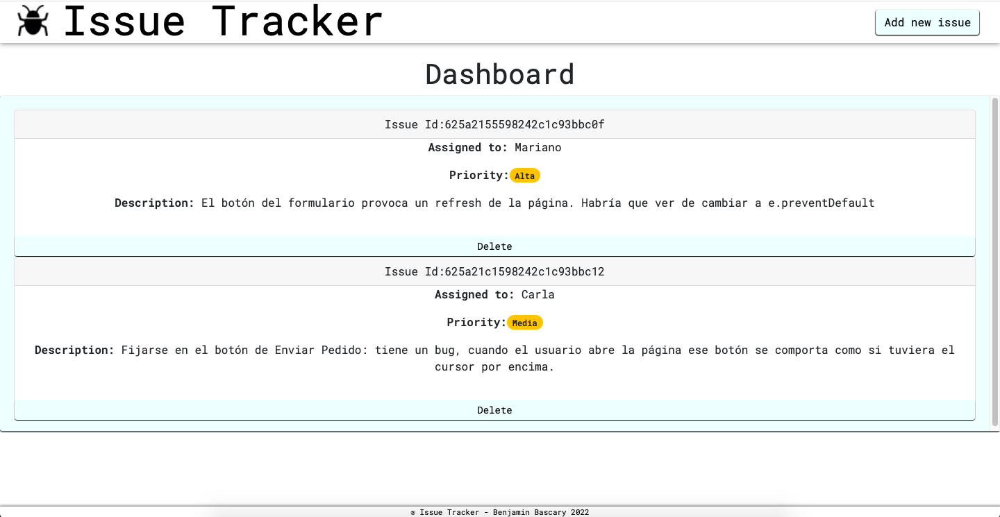
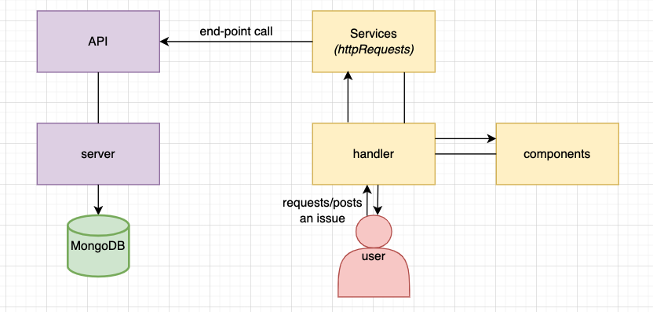

# 📱 Screenshot:

# ❓ Why's of the project:
### 🤔 I think it is grate of understanding the basic level of a fully funcitional app. How a UI connects with the server, then the DB an viceversa.
### 🚀 It is great to develop programming skills and go deeper in the back-end. Not only to play with ReactJS. I think front-end is beautiful but a simple MERN application like this is a YES overall to practicing.

# 👓 Explaining the project:
### In one side > Client: this folder contains all the UI logic.
### In the other > 
### And outside of the project: the Mongo Data Base.

# 📝 Design:
### Here is a diagram for a better understanding of how I drew this project before coding it.

# 🧰 Tools I used aside from the main tech:
### 1 - Bootstrap
### 2 - Environment Variables
### 3 - React-Router
